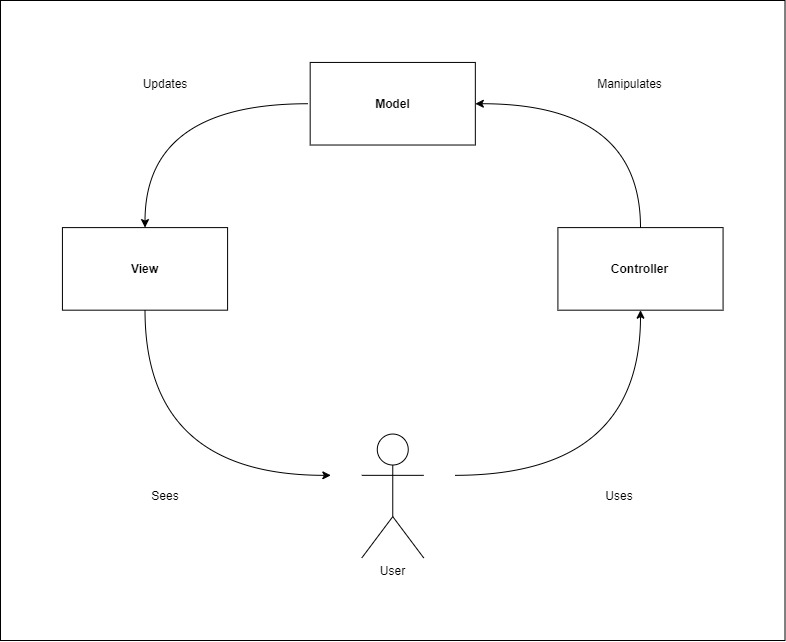
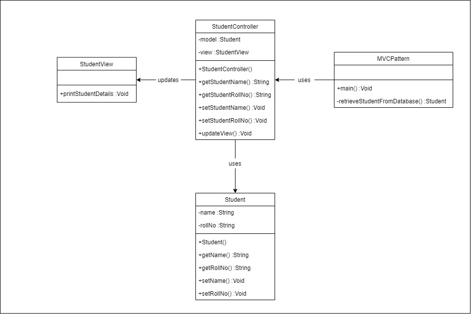

# Simple MVC Pattern with Java :nut_and_bolt:

## What is MVC ? :low_brightness:
MVC or Model-View-Controller is a pattern used in software design. This pattern commonly used for developing user interfaces that separate program logical into three interconnected element which is :
- **Model :** represents an object that carrying data and logic to update controller if data changes.
- **View :** represents the visualization of data that model contains.
- **Controller :** Keeping view and model separate and control data flow into model object and updates the view whenever data changes.

## MVC Process :bar_chart:

## MVC Pattern :triangular_ruler:

